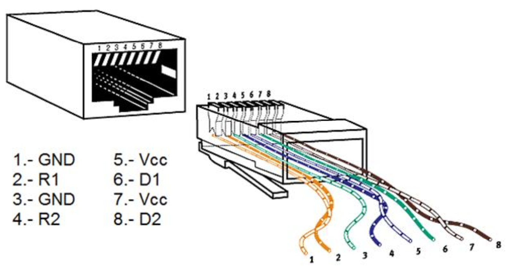

# Dome Controller

Un sistema de control realimentado para orientar automáticamente la cúpula de un observatorio de 2.5 m de diámetro.  

El motor que impulsa el movimiento de la cúpula es model TWT 12SGU de 24Vcc, 1000W y se alimenta con un driver Baldor BC204. El driver tiene una entrada SIG que sigue una tensión de +15V a -15V de acuerdo al sentido del torque deseado.  

El controlador debe instalarse en una posición cómoda para operar los controles de la cúpula y/o cercano a una PC para realizar la conexión mediante cable USB. Los sensores y relés se montan en una misma carcasa con lo cual es necesario extender la conexión para el driver del motor de la cúpula.  

## Interface

Se utilizó una caja estanca para instalar el controlador y demás hardware necesario. En la parte posterior se dispone de tres conectores, uno de alimentación, uno USB-B periférico para la comunicación con la PC y otro RJ45 para transmitir y recibir las señales de los sensores y la acción de control.  

## Microcontrolador

Para implementar el algoritmo de control se usa la plataforma Arduino Nano. Se dispone de 13 pines de entradas/salidas digitales, 8 pines de entradas analógicas, un puerto de comunicación serie entre otras características requeridas para el proyecto.  

## Acción de control

La acción de control es discreta y tiene tres estados: apagado, rotación derecha o rotación izquierda. Para desacoplar los niveles de tensión de TTL utilizado por el microcontrolador y las tensiones utilizadas por el driver del motor se utilizaron optoacopladores 4N25 y relés de 12V. Las bobinas de los relés se alimentan con las salidas de ±15V del driver para evitar transmitir esta energía por el cable a larga distancia. Para reducir el nivel de tensión a 12V se colocaron resistencias de 100Ω en serie. El esquema del bloque de actuadores se muestra a continuación:  

## Sensor de posición

La posición de la cúpula se detecta con sensores ópticos CNY70 y cintas reflectantes a lo largo de la estructura circular de modo de medir la distancia recorrida sobre el perímetro a medida que ésta se desplaza. Para determinar el sentido de giro se implementó un circuito encoder típico usando un par de flip-flop D del integrado 74HC74. Con el fin de filtrar ruido, evitar falso disparo y rebotes de la señal se usa un Smith Trigger (integrado 7414) y un filtro capacitivo como se muestra en el esquema.  

## Conectores

Para transmitir los datos de los sensores y actuadores se usa un cable tipo par trenzado de 4 pares UTP y conectores RJ45 para los chasis de las partes. La figura muestra la asignación de pines del conector donde R1 y R2 hacen referencia a las señales de activación de los relés y D1 y D2 a las señales de los sensores ópticos:  

La conexión USB para la PC se realiza mediante un conector USB tipo B para periféricos y se utiliza el pin 1 Vcc desconectado para no alimentar el sistema desde del puerto de la PC. Desde el conector montado en la plaqueta se conecta al puerto USB mini-B de Arduino con cables unifilares respetando la asignación de pines. Para alimentación se requiere 5 V y 1 A cc, con lo que se emplea un adaptador estándar.  

## Display

Para mostrar información relevante del sistema de control se emplea un display LCD de 4 filas por 20 columnas cuyo diagrama de conexión al microcontrolador se muestra en la figura a continuación. El display requiere ocupar 6 pines de entrada/salida digitales para lo que se seleccionaron los pines D7 a D12 del Arduino Nano. El pin Vo de graduación de contraste va directamente a tierra, aunque en otros esquemas se emplea un potenciómetro para variar el nivel, en este caso no hace falta por la poca nitidez de los caracteres.  

## Controles

El control manual del sistema se activa o desactiva con un pulsador push conectado al pin digital D13 y la dirección de movimiento de la cúpula se elige con una llave selectora de tres puntos cuya posición se lee con el pin analógico A7.  

## Materiales y costos estimados

(U$D 1 = AR$ 15)

|Componente | Cantidad | Precio U. | Subtotal|
|-|:-:|:-:|:-:|
|Arduino Nano | 1 | 250 | 250|
|Bornera 2P 8A 300V |2 |5,5 |11|
|Cable interfaz IDE |1 |1,75 |1,75|
|Capacitor 100nF |1 |3 |3|
|Capacitor 10nF |2 |3 |6|
|Cloruro Férrico 250ml |0,02 |48 |0,96|
|Transformador 5V 1A |1 |75 |75|
|Chasis Plástico 150x140x80 |1 |165 |165|
|Chasis Plástico 115x75x33 |1 |80 |80|
|CI 7414 |1 |20 |20|
|CI 7474 |1 |25 |25|
|Conector Alimentación 5V macho |1 |5 |5|
|Conector Alimentación 5V hembra |1 |7,5 |7,5|
|Conector RJ45 hembra |2 |15 |30|
|Conector RJ45 macho |2 |12,5 |25|
|Conector Mini USB |1 |15 |15|
|Conector USB-B |1 |18 |18|
|Detector IR CNY70 |2 |45 |90|
|Display LCD 20x4 |1 |280 |280|
|Estaño 250gr. |0,05 |250 |12,5|
|Led |2 |2 |4|
|Llave selectora 3 pts. |1 |15 |15|
|Optoacoplador 4N25 |2 |12 |24|
|Papel satinado A4 + impresión |2 |2 |4|
|Plaqueta virgen pertinax 10x5 |1 |15 |15|
|Plaqueta virgen pertinax 5x5 |1 |8 |8|
|Plaqueta universal perforada 5x5 |0,5 |10 |5|
|Portaled |2 |1,5 |3|
|Pulsador |1 |9,5 |9,5|
|Relay HJR-21FF 12V |2 |26 |52|
|Resistencia 1/4W |9 |0,75 |6,75|
|Switch On/Off |1 |12 |12|
|Termocontraíble 5 Metros |0,1 |90 |9|
|Tira de pines hembra p/cable |1 |25 |25|
|Tira de pines hembra p/soldar |1 |30 |30|
|Tira de pines macho p/soldar |1 |10 |10|
|||Total |1352,96|